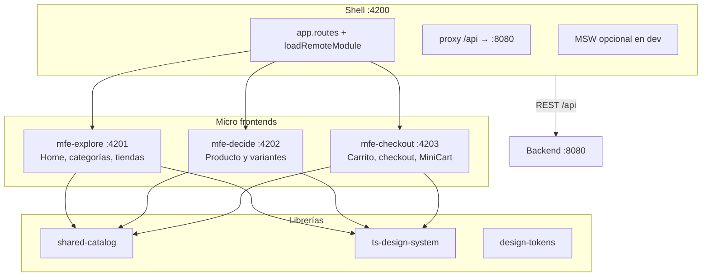
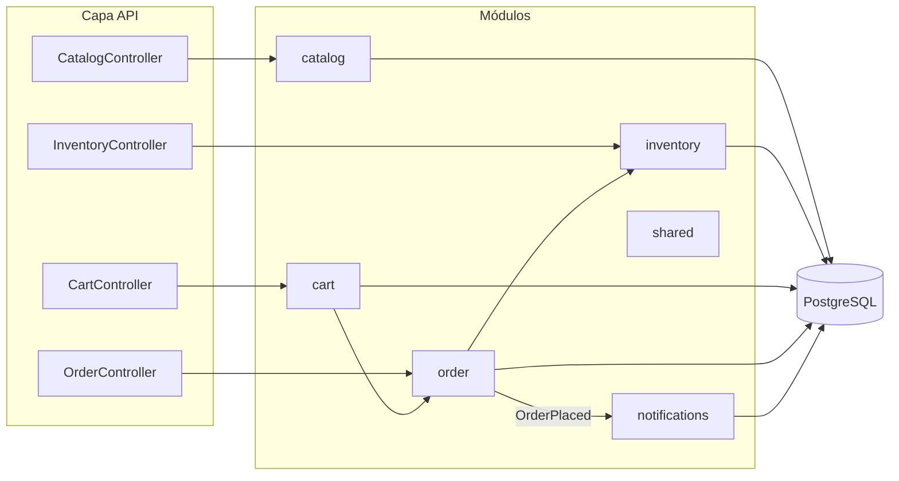
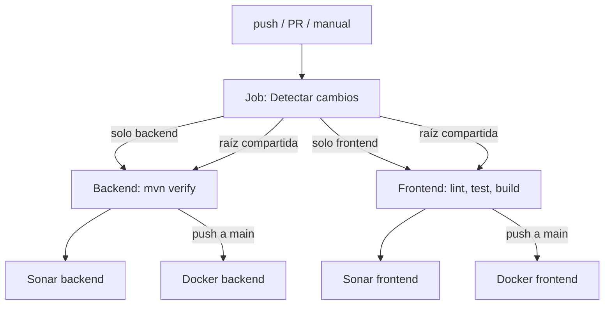

# Tractor Store — Hackaton Quind

Implementación full stack del [Tractor Store 2.0](https://micro-frontends.org/tractor-store/): tienda modular con **micro frontends** (Angular) y **monolito modular** (Spring Boot), empaquetados en un **monorepo** único.

[](https://github.com/LeonardoAragonez/Hackaton/actions/workflows/ci.yml)

---

## Tabla de contenidos

- [Qué se implementó](#qué-se-implementó)
- [Estructura del monorepo](#estructura-del-monorepo)
- [Tecnologías](#tecnologías)
- [Arquitectura frontend](#arquitectura-frontend)
- [Arquitectura backend](#arquitectura-backend)
- [Patrones de diseño](#patrones-de-diseño)
- [API REST](#api-rest)
- [CI/CD y pipelines](#cicd-y-pipelines)
- [Cómo ejecutarlo](#cómo-ejecutarlo)
- [Tests](#tests)
- [Documentación adicional](#documentación-adicional)

---

## Qué se implementó

| Área | Entregable |
|------|------------|
| **Frontend** | Monorepo **Nx** con **shell** host y **3 micro frontends** (explore, decide, checkout) vía **Webpack Module Federation** |
| **UI** | **Design system** (`ts-design-system`), **design tokens** CSS y build opcional de **Angular Elements** |
| **Integración** | Librería **shared-catalog** (modelos, tokens HTTP, **MSW**, event bus entre MFEs) |
| **Backend** | **Monolito modular** con **Spring Modulith**: catalog, inventory, cart, order, notifications |
| **Datos** | **PostgreSQL**, migraciones **Flyway**, seed JSON al arranque |
| **Calidad** | Tests Jest (UI/shared), Playwright E2E, WebMvcTest/integración backend, **ArchUnit** y verificación Modulith |
| **DevOps** | `docker-compose.yml`, Dockerfiles, pipeline **GitHub Actions** con ejecución condicional por paths |
| **Docs** | README, ADRs, TESTING.md, DEPLOYMENT.md, CONTRIBUTING.md (según guía del reto) |

Flujo de negocio cubierto: **explorar catálogo → elegir producto/variante → carrito → checkout → pedido**, alineado con el blueprint oficial.

---

## Estructura del monorepo

```text
Hackaton/
├── .github/workflows/ci.yml    # Pipeline único CI/CD
├── docker-compose.yml          # Stack: Postgres + backend + frontend
├── tractor-store-frontend/     # Nx + Angular 19 + Module Federation
│   ├── apps/shell/             # Host (puerto 4200)
│   ├── packages/mfe-explore/   # Remote 4201
│   ├── packages/mfe-decide/    # Remote 4202
│   ├── packages/mfe-checkout/  # Remote 4203
│   ├── packages/shared-catalog/
│   ├── packages/ts-design-system/
│   └── packages/design-tokens/
└── tractor-store-backend/      # Spring Boot 3.4 + Java 21
    ├── src/main/java/.../catalog|inventory|cart|order|notifications|shared
    ├── src/main/resources/db/migration/
    └── src/main/resources/seed/
```

---

## Tecnologías

| Capa | Tecnología | Versión / nota |
|------|------------|----------------|
| **Frontend** | Angular | 19 |
| | Nx | 21 |
| | Module Federation (Webpack) | Shell + remotes |
| | pnpm | 9 |
| | Tailwind CSS | Estilos utilitarios |
| | MSW | Mock API en desarrollo |
| | Jest | Unit tests (design-system, shared-catalog) |
| | Playwright | E2E (`purchase-flow`) |
| **Backend** | Java | 21 |
| | Spring Boot | 3.4 |
| | Spring Modulith | Fronteras de módulo |
| | Spring Data JPA | Persistencia |
| | Flyway | Migraciones SQL |
| | PostgreSQL | 16 |
| | springdoc-openapi | Swagger UI |
| | Testcontainers | Integración con Postgres (opcional, requiere Docker) |
| | JaCoCo | Cobertura backend |
| **Infra** | Docker / Compose | Despliegue local |
| | GitHub Actions | CI/CD |
| | SonarCloud | Calidad (config en `sonar-project.properties`) |
| | Dependabot | Actualización de dependencias |

---

## Arquitectura frontend

### Visión general

La shell (`apps/shell`) es el **host** de Module Federation: define el routing principal y carga en runtime los remotes `mfe-explore`, `mfe-decide` y `mfe-checkout` mediante `remoteEntry.js`.



### Responsabilidad por MFE

| MFE | Puerto dev | Dominio | Expone |
|-----|------------|---------|--------|
| **mfe-explore** | 4201 | Descubrimiento | `./Routes` (home, categoría, tiendas) |
| **mfe-decide** | 4202 | Decisión de compra | `./Routes` (detalle producto, `?sku=`) |
| **mfe-checkout** | 4203 | Compra | `./Routes` + `./MiniCart` (widget en shell) |

### Comunicación

- **Shell → remotes:** rutas lazy con `@nx/angular/mf` (`loadRemoteModule`).
- **MFE ↔ MFE:** bus de eventos en `shared-catalog` (`catalogEventBus`), p. ej. `checkout:cart-updated`.
- **Frontend → backend:** `HttpClient` con tokens `CATALOG_API_URL`, `CART_API_URL`, `ORDER_API_URL`; en dev, **MSW** o **proxy** hacia `localhost:8080`.

Detalle en [tractor-store-frontend/docs/adr/001-module-federation.md](./tractor-store-frontend/docs/adr/001-module-federation.md).

---

## Arquitectura backend

### Monolito modular (Spring Modulith)

Un único despliegue (JAR/contenedor) con **módulos acotados** y dependencias controladas. Cada módulo expone una **fachada** (`*Facade`) hacia el exterior y encapsula API REST + lógica interna + persistencia.



| Módulo | Responsabilidad |
|--------|-----------------|
| **catalog** | Home, categorías, productos, recomendaciones, tiendas |
| **inventory** | Stock por SKU |
| **cart** | Carrito por cookie de sesión (`CART_SESSION`) |
| **order** | Checkout y consulta de pedidos |
| **notifications** | Registro/log al evento `OrderPlaced` |
| **shared** | Config, CORS, errores API, eventos de dominio |

Migraciones en `db/migration/`; datos iniciales desde `src/main/resources/seed/*.json` vía `ApplicationRunner` (catalog + inventory).

Detalle en [tractor-store-backend/docs/adr/001-modular-monolith-with-spring-modulith.md](./tractor-store-backend/docs/adr/001-modular-monolith-with-spring-modulith.md).

---

## Patrones de diseño

### Frontend

| Patrón | Dónde | Para qué |
|--------|-------|----------|
| **Micro Frontends** | Shell + 3 remotes | Equipos/dominios independientes (explore, decide, checkout) |
| **Module Federation** | `webpack.config.js` + `module-federation.config.js` | Carga dinámica de remotes y shared singletons (Angular, RxJS) |
| **Facade (estado)** | `*.facade.ts` en cada MFE | Orquesta acciones, selectores y llamadas API |
| **Store con Signals** | `*.state.ts`, `*.selectors.ts` | Estado reactivo local por MFE |
| **Standalone components** | Angular 19 | Componentes sin NgModules |
| **Injection tokens** | `shared-catalog` | URLs de API configurables por `app.config` |
| **Mapper** | `cart.mapper.ts` | DTO backend → modelo UI |
| **MSW (Adapter)** | `handlers.ts` | Simular contrato REST en desarrollo |
| **Event bus** | `catalog.events.ts` | Desacoplar MFEs sin acoplar bundles |
| **Design system** | `ts-design-system` | UI reutilizable (botones, cards, mini-cart, etc.) |

### Backend

| Patrón | Dónde | Para qué |
|--------|-------|----------|
| **Modular monolith** | Spring Modulith | Límites claros sin microservicios |
| **Facade** | `CatalogFacade`, `CartFacade`, … | API pública del módulo |
| **Layered architecture** | `api` → `internal` → `persistence` | Separación REST / dominio / JPA |
| **Repository** | Spring Data JPA | Acceso a datos |
| **Domain events** | `OrderPlaced` + `@TransactionalEventListener` | Notificaciones tras commit del pedido |
| **Session cookie** | `CartSessionResolver` | Carrito anónimo persistente |
| **DTO / records** | `*Dtos.java` | Contratos REST explícitos |
| **Global exception handling** | `GlobalExceptionHandler` | Errores `{ code, message, details? }` uniformes |
| **Database migration** | Flyway | Esquema versionado |
| **Seed / bootstrap data** | `*SeedLoader` | Poblar catálogo e inventario al inicio |

---

## API REST

Base: `http://localhost:8080` · Documentación: [Swagger UI](http://localhost:8080/swagger-ui.html)

| Método | Ruta | Descripción |
|--------|------|-------------|
| GET | `/api/catalog/home` | Teasers y categorías |
| GET | `/api/catalog/categories/{key}` | Productos de una categoría |
| GET | `/api/catalog/products/{id}` | Detalle con variantes |
| GET | `/api/catalog/recommendations` | Recomendaciones |
| GET | `/api/catalog/stores` | Tiendas físicas |
| GET | `/api/inventory/{sku}` | Stock |
| GET | `/api/cart` | Carrito completo |
| GET | `/api/cart/mini` | Resumen (cantidad y total) |
| POST | `/api/cart/items` | Añadir línea `{ "sku": "..." }` |
| DELETE | `/api/cart/items/{sku}` | Quitar o reducir cantidad |
| POST | `/api/orders` | Crear pedido desde el carrito |
| GET | `/api/orders/{id}` | Detalle del pedido |

---

## CI/CD y pipelines

Un único workflow en [`.github/workflows/ci.yml`](./.github/workflows/ci.yml) (`CI/CD`).

### Flujo



### Reglas de ejecución (paths)

| Cambios en… | Jobs que corren |
|-------------|-----------------|
| `tractor-store-backend/**` | Backend (+ Sonar/Docker en `main`) |
| `tractor-store-frontend/**` | Frontend (+ Sonar/Docker en `main`) |
| `.github/`, `docker-compose.yml`, README, guías… | **Ambos** |
| **Run workflow** (manual) | **Ambos** |

### Jobs principales

| Job | Herramienta | Acción |
|-----|-------------|--------|
| **Backend** | Maven 21 | `mvn verify`, artefacto JaCoCo |
| **Frontend** | pnpm 9, Node 20 | `pnpm lint`, `pnpm test`, `pnpm build` |
| **SonarCloud** | Sonar scan | Secret `SONAR_TOKEN`; en SonarCloud desactivar **Automatic Analysis** (solo CI con cobertura) |
| **Docker** | `docker build` | Solo en push a `main` |

[Dependabot](./.github/dependabot.yml) abre PRs semanales para npm (frontend), Maven (backend) y GitHub Actions.

Más detalle del flujo Git y Actions: [CONTRIBUTING.md](./CONTRIBUTING.md).

---

## Cómo ejecutarlo

### Requisitos

| Herramienta | Versión |
|-------------|---------|
| Docker + Compose | Stack completo |
| Java | 21 |
| Maven | 3.9+ |
| Node.js | 20+ |
| pnpm | 9+ |

### Opción 1 — Todo el stack con Docker (recomendado)

```bash
cd Hackaton
docker compose up --build
```

| Servicio | URL |
|----------|-----|
| Tienda | http://localhost:4200 |
| API + Swagger | http://localhost:8080/swagger-ui.html |
| PostgreSQL | `localhost:5433` — usuario/contraseña/BD: `tractor` / `tractor` / `tractor_store` |

### Opción 2 — Desarrollo local

**PostgreSQL**

```bash
docker run --name tractor-pg -e POSTGRES_DB=tractor_store \
  -e POSTGRES_USER=tractor -e POSTGRES_PASSWORD=tractor \
  -p 5433:5432 -d postgres:16-alpine
```

**Backend**

```bash
cd tractor-store-backend
mvn spring-boot:run
```

**Frontend** (en otra terminal; requiere `node` en el PATH)

```bash
cd tractor-store-frontend
pnpm install
# Solo la primera vez (si falta mockServiceWorker.js):
pnpm exec msw init apps/shell/public --save
pnpm start
```

Abre http://localhost:4200.

- Con **backend apagado**: MSW puede responder `/api` (perfil dev, `useMsw: true`).
- Con **backend encendido**: el proxy de la shell reenvía `/api` a `http://localhost:8080`.

**Importante:** usa `pnpm start` (shell + 3 remotes). No abras solo el puerto 4201–4203; la tienda vive en **4200**.

**Tests y cobertura (frontend)**

```bash
cd tractor-store-frontend
pnpm test:coverage
# Reportes HTML: coverage/packages/*/index.html
```

Incluye `shared-catalog`, `ts-design-system` y tests unitarios de selectores en los MFE (`mfe-explore`, `mfe-decide`, `mfe-checkout`).

**SonarCloud — cobertura y Summary**

| Pestaña en Summary | Qué muestra |
|--------------------|-------------|
| **Overall Code** | % global (backend + frontend medidos) |
| **New Code** | Solo cambios recientes; exige tests en lo que acabas de commitear |

1. En **Summary**, arriba, cambia **New Code** → **Overall Code** para ver el % total.
2. **Measures** → **Coverage** → desglose por carpeta.
3. La cobertura en Sonar cuenta **lógica de negocio** (`shared-catalog`, `ts-design-system`, servicios Java); UI Angular, entidades JPA y DTOs van en `sonar.coverage.exclusions` (ver `sonar-project.properties`).
4. Job **SonarCloud (Hackaton monorepo)** verde tras cada push.

**Quality Gate (80 % en código nuevo):** el gate **no** usa el 49 % de *Overall Code*; exige **≥ 80 % de cobertura en las líneas que cambiaste** en la rama (p. ej. `feature/develop`). Si ves *57 % on 5 New Lines*, añade tests en backend (`OrderService`, `InventoryFacade`, `CatalogFacade`, `CartSessionResolver`) o en `shared-catalog` (`bootstrap-error.util.spec.ts`). El job **SonarCloud (Hackaton monorepo)** debe pasar en verde tras el push. Las *3 New Issues* son aparte: revísalas en **Issues** → **New**.

### Build de producción (local)

```bash
# Frontend
cd tractor-store-frontend && pnpm build

# Backend
cd tractor-store-backend && mvn -DskipTests package
```

---

## Tests

```bash
# Backend
cd tractor-store-backend && mvn test

# Frontend
cd tractor-store-frontend && pnpm test

# E2E (con la app levantada en :4200)
cd tractor-store-frontend && pnpm exec playwright install chromium && pnpm e2e
```

| Tipo | Ubicación |
|------|-----------|
| Modulith + ArchUnit | `ModulithArchitectureTest`, `ArchUnitRulesTest` |
| WebMvcTest / unit / H2 | `src/test/java/...` |
| Testcontainers | `CartFlowIntegrationTest` (requiere Docker) |
| Jest | `ts-design-system`, `shared-catalog` |
| Playwright | `e2e/src/purchase-flow.spec.ts` |

Ver [tractor-store-backend/TESTING.md](./tractor-store-backend/TESTING.md) y [tractor-store-frontend/TESTING.md](./tractor-store-frontend/TESTING.md).

---

## Documentación del reto

Según la guía de aprendizaje Tractor Store:

| Documento | Obligatorio | Ubicación |
|-----------|-------------|-----------|
| README monorepo | Sesiones 1–2 | Este archivo |
| README por stack | Sesiones 1–2 | [frontend](./tractor-store-frontend/README.md), [backend](./tractor-store-backend/README.md) |
| TESTING.md | Sesiones 1–2 | [frontend](./tractor-store-frontend/TESTING.md), [backend](./tractor-store-backend/TESTING.md) |
| ADRs | Sesiones 1–2 | [frontend/docs/adr/](./tractor-store-frontend/docs/adr/), [backend/docs/adr/](./tractor-store-backend/docs/adr/) |
| DEPLOYMENT.md | Sesión 3 | [DEPLOYMENT.md](./DEPLOYMENT.md) |
| CONTRIBUTING.md + plantilla PR | Sesión 3 | [CONTRIBUTING.md](./CONTRIBUTING.md), [.github/PULL_REQUEST_TEMPLATE.md](./.github/PULL_REQUEST_TEMPLATE.md) |

Los archivos `GUIA-COMPLETAR-100.md` y `GIT-GITHUB.md` **no** forman parte de los entregables oficiales; eran notas internas opcionales y no es necesario crearlos para el reto.

---

## Licencia

Proyecto educativo para el reto **Tractor Store — Quind** (MIT).
